# IT Security Assessment Frameworks by Country

## A Multi-Framework Reference for SA&A Tool Expansion

> **Scope:** This document covers IT-focused security assessment and authorization frameworks used by governments and regulated sectors across Canada, the United States, Europe, and Australia. Frameworks are limited to those with a structured IT security control assessment lifecycle compatible with SA&A-style tooling (control catalogues, risk categorization, evidence collection, authorization decisions, and continuous monitoring).

---

## Table of Contents

1. [Common SA&amp;A Lifecycle (Universal Model)](#universal-model)
2. [Canada](#canada)
3. [United States](#united-states)
4. [Europe](#europe)
5. [Australia](#australia)
6. [Cross-Sector / International](#international)
7. [Multi-Framework Data Model](#data-model)
8. [Framework Comparison Matrix](#matrix)

---

## 1. Common SA&A Lifecycle (Universal Model)

Despite differences in terminology and control catalogues, all IT security assessment frameworks share the same fundamental lifecycle. This is the core engine your tool already implements for ITSG-33.

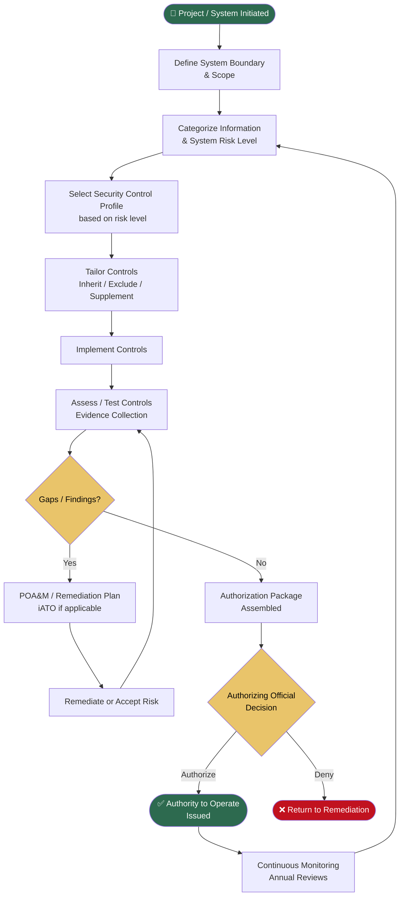

---

## 2. Canada

### 2.1 ITSG-33 — IT Security Risk Management

**Issuing Body:** Canadian Centre for Cyber Security (CCCS) / Treasury Board of Canada Secretariat (TBS)
**Applies To:** All Government of Canada (GoC) federal departments and agencies
**Legislative Basis:** *Policy on Government Security* (TBS), *Directive on Security Management*
**Level:** Federal

ITSG-33 is the primary GoC framework for IT security risk management. It defines a full SA&A lifecycle including system categorization (based on Confidentiality/Integrity/Availability business impact), control profile selection, assessment, and Authority to Operate (ATO) issuance. Controls are organized into 18 families aligned to NIST SP 800-53.

**Key Concepts:**

* Business Impact Levels: Low / Medium / High per CIA triad axis
* Control Profiles: PBMM (Protected B / Medium / Medium) is the most common cloud baseline
* Roles: System Owner, IT Security Coordinator, Authorizing Official (AO), Assessor
* Outputs: Security Assessment Report (SAR), ATO Letter, POA&M

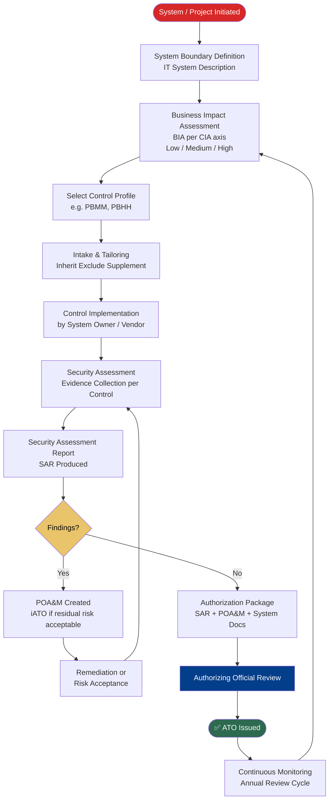

---

### 2.2 CCCS Medium Profile (PBMM)

**Issuing Body:** Canadian Centre for Cyber Security
**Applies To:** Cloud service providers handling GoC Protected B data
**Legislative Basis:** TBS *Direction on the Secure Use of Commercial Cloud Services (SPIN 2017-01)*
**Level:** Federal (Cloud)

The CCCS Medium Profile superseded the original GC Cloud Control Profile. It is a tailored subset of ITSG-33 controls specifically for cloud environments targeting Protected B / Medium Integrity / Medium Availability. Cloud service providers (CSPs) undergo assessment by CCCS before being listed as approved for GC use.

**Key Concepts:**

* Based on ITSG-33 control families but scoped to cloud delivery models (IaaS/PaaS/SaaS)
* CSPs assessed independently; departments inherit cloud baseline and assess residual controls
* Shared Responsibility Model is central
* Aligns with FedRAMP Moderate (US) for mutual recognition purposes

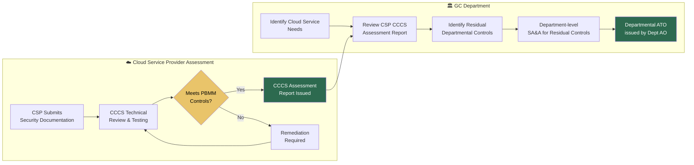

---

### 2.3 OSFI Guideline B-13 — Technology and Cyber Risk Management

**Issuing Body:** Office of the Superintendent of Financial Institutions (OSFI)
**Applies To:** All Federally Regulated Financial Institutions (FRFIs) — banks, insurers, trust companies
**Legislative Basis:**  *Office of the Superintendent of Financial Institutions Act* ,  *Bank Act* , *Insurance Companies Act*
**Level:** Federal / Financial Sector

B-13 is the primary IT and cyber risk management standard for Canadian banks and insurers. Unlike a traditional SA&A framework, it uses an outcomes-based approach organized around Technology Operations, Cyber Security, and Technology Risk Governance. FRFIs must assess their posture against B-13 expectations and demonstrate continuous improvement.

**Key Domains:**

1. Governance & Accountability
2. Technology Asset Management
3. Technology Operations
4. Cyber Security (Identify / Protect / Detect / Respond / Recover)
5. Technology Risk Management

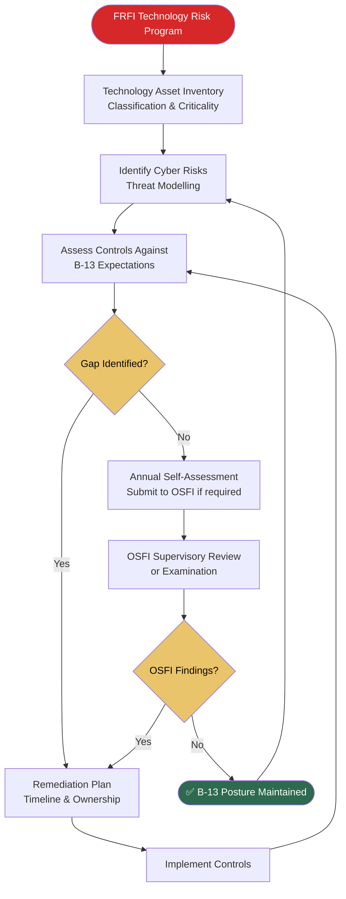

---

## 3. United States

### 3.1 NIST RMF + SP 800-53 Rev. 5

**Issuing Body:** National Institute of Standards and Technology (NIST)
**Applies To:** All US Federal agencies and their information systems
**Legislative Basis:** *Federal Information Security Modernization Act (FISMA) 2014*
**Level:** Federal

The NIST Risk Management Framework (SP 800-37 Rev. 2) is the US federal equivalent of ITSG-33. It defines a 7-step lifecycle for categorizing systems, selecting controls from SP 800-53, assessing them, and issuing an Authority to Operate (ATO). SP 800-53 Rev. 5 contains 20 control families with over 1,000 controls and control enhancements. The process maps almost directly to your existing ITSG-33 tool architecture.

**Key Concepts:**

* System categorization via FIPS 199 (Low / Moderate / High)
* Control baselines: SP 800-53B (Low / Moderate / High baselines)
* Roles: System Owner, ISSO, ISSM, Authorizing Official (AO), Security Control Assessor (SCA)
* Privacy controls integrated into SP 800-53 Rev. 5
* OSCAL support for machine-readable control assessment data

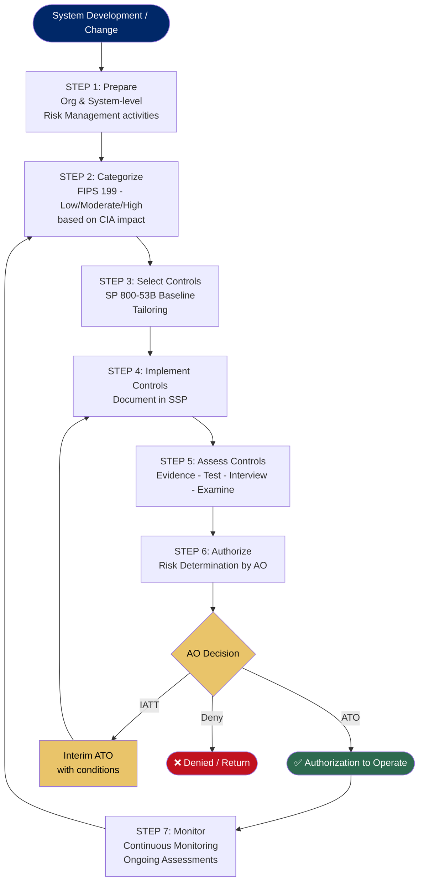

---

### 3.2 FedRAMP

**Issuing Body:** General Services Administration (GSA) / FedRAMP PMO
**Applies To:** Cloud Service Providers (CSPs) offering services to US Federal agencies
**Legislative Basis:**  *FedRAMP Authorization Act (2022)* , *OMB Memo M-11-33*
**Level:** Federal (Cloud)

FedRAMP is built on NIST SP 800-53 controls and follows a "do once, use many times" philosophy. CSPs achieve authorization at one of three impact levels (Low, Moderate, High) and federal agencies can reuse the authorization package rather than conducting independent assessments. Assessments are performed by accredited Third Party Assessment Organizations (3PAOs).

**Authorization Paths:**

* **Agency Authorization** — a single agency sponsors and authorizes a CSP
* **JAB Provisional ATO (P-ATO)** — Joint Authorization Board (GSA/DoD/DHS) issues a provisional authorization reusable by any agency

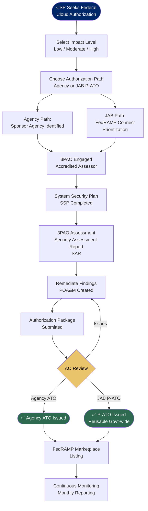

---

### 3.3 CMMC 2.0 — Cybersecurity Maturity Model Certification

**Issuing Body:** US Department of Defense (DoD)
**Applies To:** Defense Industrial Base (DIB) contractors and subcontractors handling CUI/FCI
**Legislative Basis:**  *DFARS 252.204-7021* , Code of Federal Regulations 32 CFR Part 170
**Level:** Federal / Defense Sector

CMMC 2.0 certifies that organizations handling Controlled Unclassified Information (CUI) or Federal Contract Information (FCI) meet required cybersecurity practices. Based on NIST SP 800-171 (derived from SP 800-53). Three maturity levels. Third-party assessments required for Level 2 and above when handling sensitive CUI.

**Maturity Levels:**

* **Level 1 (Foundational):** 17 practices, annual self-assessment
* **Level 2 (Advanced):** 110 practices from NIST SP 800-171, triennial 3rd party assessment
* **Level 3 (Expert):** 110+ practices including SP 800-172, government-led assessment

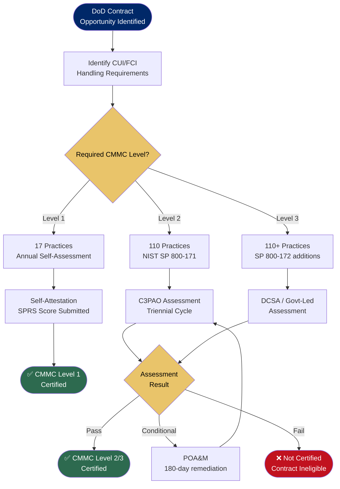

---

### 3.4 StateRAMP

**Issuing Body:** StateRAMP (nonprofit standards body)
**Applies To:** Cloud Service Providers working with US state and local governments
**Legislative Basis:** Adopted by Texas (HB 3834), Illinois, Colorado and others via state law or procurement policy
**Level:** State Government (Cloud)

StateRAMP mirrors FedRAMP's model for the state/local government market. CSPs achieve authorization at Low, Moderate, or High impact levels. A Provisional Authorization is reusable across member states. Growing rapidly as states modernize procurement requirements.

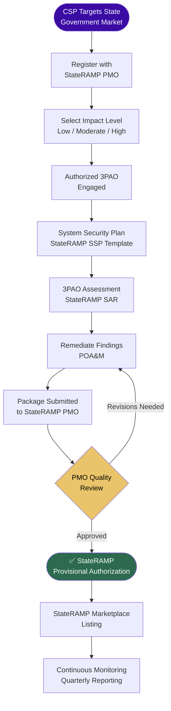

---

### 3.5 NYDFS 23 NYCRR Part 500

**Issuing Body:** New York Department of Financial Services (NYDFS)
**Applies To:** All NY-chartered banks, insurers, mortgage companies, and licensed financial services entities
**Legislative Basis:**  *New York Banking Law* ,  *Insurance Law* ; regulation effective 2017, amended 2023
**Level:** State / Financial Sector

One of the most comprehensive state-level financial cybersecurity regulations in the US. Requires a formal cybersecurity program, risk assessments, a CISO, annual penetration testing, and specific incident notification timelines. The 2023 amendments added requirements for large covered entities including annual independent audits.

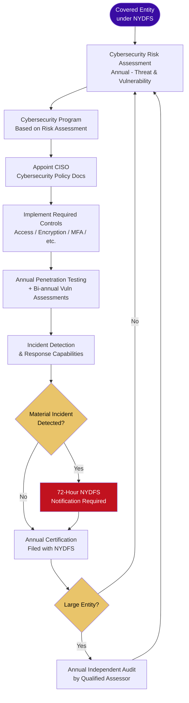

---

## 4. Europe

### 4.1 NIS2 Directive (EU 2022/2555)

**Issuing Body:** European Commission / Transposed by each EU Member State
**Applies To:** Essential and Important entities across 18 critical sectors including public administration, digital infrastructure, finance, health, energy, transport
**Legislative Basis:** EU Directive 2022/2555, transposed into national law by October 2024
**Level:** EU-wide / National (varies by member state)

NIS2 is the EU's primary cybersecurity risk management directive. It does not prescribe a specific control catalogue but mandates that organizations implement proportionate technical and organizational security measures. Member states reference ISO 27001, NIST CSF, or national frameworks (e.g., BSI IT-Grundschutz in Germany, CyFun in Belgium) as the means of compliance. Covered entities must register with national authorities, conduct risk assessments, and report significant incidents.

**Entity Classification:**

* **Essential Entities:** Energy, transport, banking, financial market infrastructure, health, drinking water, digital infrastructure, public administration, space
* **Important Entities:** Postal, waste management, manufacturing, food, chemicals, research, digital providers

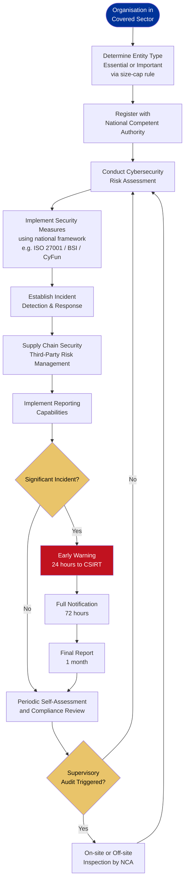

---

### 4.2 DORA — Digital Operational Resilience Act (EU 2022/2554)

**Issuing Body:** European Commission (enforced by ESAs: EBA, EIOPA, ESMA)
**Applies To:** Banks, payment institutions, investment firms, insurance companies, crypto-asset service providers, and their critical ICT third-party providers operating in the EU
**Legislative Basis:** EU Regulation 2022/2554 (directly applicable, no transposition needed), enforceable from January 17, 2025
**Level:** EU-wide / Financial Sector

DORA is the most detailed EU IT security regulation for financial services. Unlike NIS2 (a directive), DORA is a regulation — directly enforceable in all member states with no national variation. It mandates a full ICT Risk Management Framework with five pillars. The Threat-Led Penetration Testing (TLPT) requirement is particularly notable — similar in spirit to a formal security assessment and authorization process.

**Five Pillars:**

1. ICT Risk Management Framework
2. ICT Incident Classification, Reporting & Management
3. Digital Operational Resilience Testing (including TLPT)
4. ICT Third-Party Risk Management
5. Information Sharing

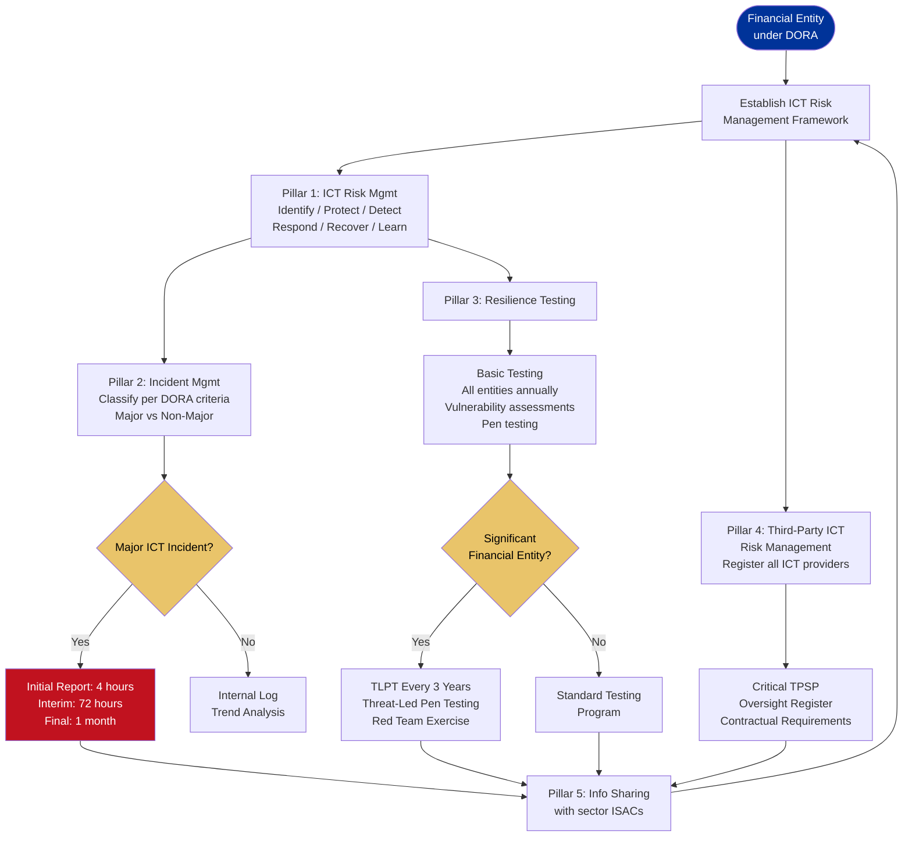

---

### 4.3 BSI IT-Grundschutz

**Issuing Body:** German Federal Office for Information Security (Bundesamt für Sicherheit in der Informationstechnik — BSI)
**Applies To:** German federal and state agencies; widely adopted by German private sector and EU entities
**Legislative Basis:** German BSI Act (BSIG), updated December 2025 as NIS2 implementation vehicle
**Level:** National (Germany) / widely referenced EU-wide

IT-Grundschutz is one of the most detailed IT security frameworks in the world, providing highly prescriptive building blocks (Bausteine) for specific system types and scenarios. Organizations can pursue ISO 27001 certification on the basis of IT-Grundschutz. The framework has three protection requirement levels and four implementation methodologies.

**Protection Levels:** Normal / High / Very High
**Methodologies:** Basic / Standard / Core / Combined

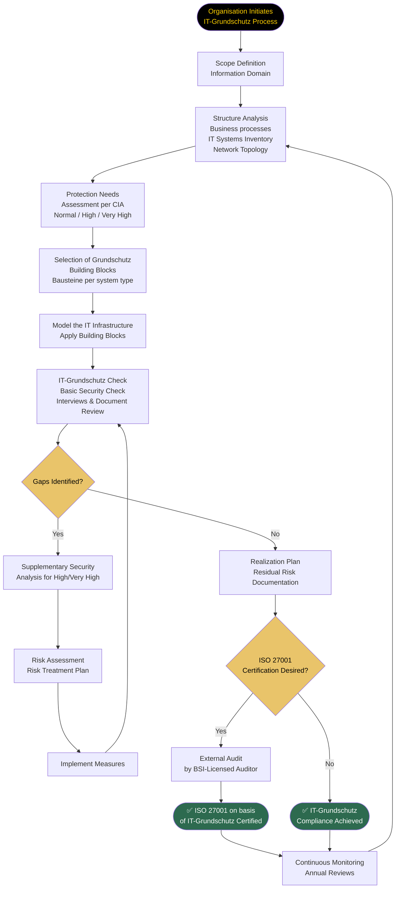

---

### 4.4 ANSSI RGS / EBIOS RM (France)

**Issuing Body:** Agence nationale de la sécurité des systèmes d'information (ANSSI)
**Applies To:** French public administrations and operators of vital importance (OIV)
**Legislative Basis:**  *Ordonnance n° 2005-1516 (RGS)* , *Loi de Programmation Militaire (LPM)* for OIVs
**Level:** National (France)

The RGS (Référentiel Général de Sécurité) defines security levels for information systems used by French public services. EBIOS Risk Manager (EBIOS RM) is the companion risk assessment methodology, jointly developed by ANSSI and the Club EBIOS. EBIOS RM is one of the most sophisticated risk assessment methodologies available, using attack path scenarios and ecosystem analysis.

**RGS Security Levels:** Standard / Enhanced / High
**EBIOS RM Workshops:**

1. Framework and Security Baseline
2. Risk Sources and Objectives
3. Strategic Scenarios
4. Operational Scenarios
5. Risk Treatment

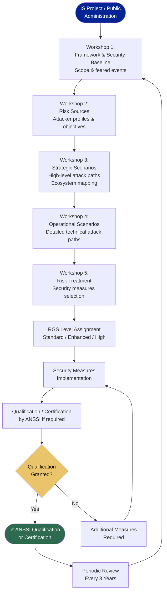

---

### 4.5 NCSC CAF — Cyber Assessment Framework (UK)

**Issuing Body:** UK National Cyber Security Centre (NCSC)
**Applies To:** UK Critical National Infrastructure operators, NIS-regulated entities, government departments
**Legislative Basis:** UK  *NIS Regulations 2018* , *Network and Information Systems (Amendment etc.) (EU Exit) Regulations 2019*
**Level:** National (United Kingdom)

The CAF provides a structured set of 14 cybersecurity outcomes across 4 objectives. Regulators and operators use it to assess security posture against defined Indicators of Good Practice (IGPs). The CAF is outcome-focused rather than prescriptive — organizations determine how to achieve each outcome based on their context.

**Four Objectives:**

* A: Managing Security Risk
* B: Protecting Against Cyber Attack
* C: Detecting Cyber Security Events
* D: Minimising the Impact of Cyber Security Incidents

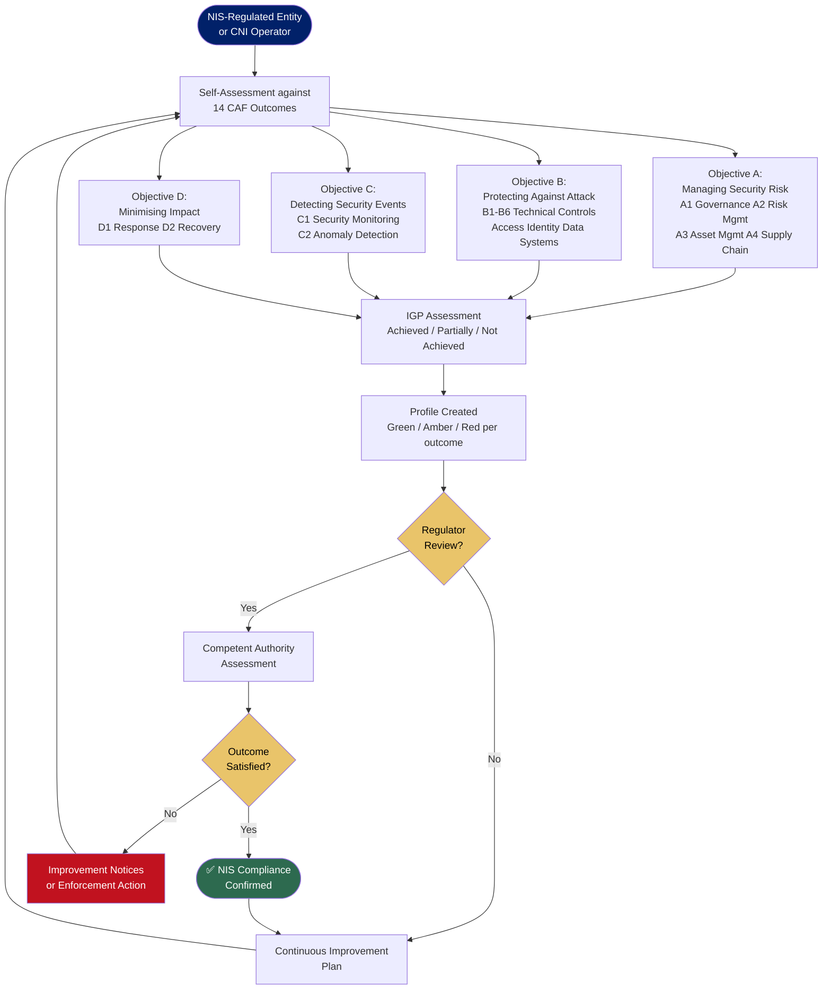

---

### 4.6 Spain ENS — Esquema Nacional de Seguridad

**Issuing Body:** Centro Criptológico Nacional (CCN-CERT) / CPSTIC
**Applies To:** All Spanish public administrations and their technology suppliers
**Legislative Basis:** Royal Decree 311/2022 (updated ENS), transposing NIS2 obligations for public sector
**Level:** National (Spain)

ENS defines security categories (Basic / Medium / High) and prescribes mandatory security measures through the CCN-STIC guide series. It is one of the most prescriptive national frameworks in Europe. Technology providers to the Spanish public sector must obtain ENS certification. Audits are mandatory for Medium and High category systems.

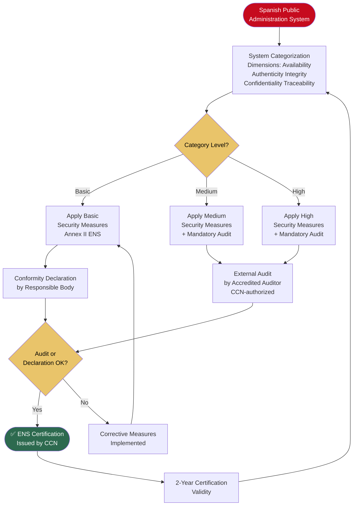

---

## 5. Australia

### 5.1 ASD Information Security Manual (ISM) + IRAP

**Issuing Body:** Australian Signals Directorate (ASD)
**Applies To:** All Australian Commonwealth agencies, state governments, and private sector entities handling government data
**Legislative Basis:**  *Intelligence Services Act 2001* , *Security of Critical Infrastructure Act 2018 (SOCI Act)*
**Level:** Federal + State (widely)

The ISM is Australia's primary IT security framework — the direct equivalent of ITSG-33. It is updated multiple times per year. Organizations use the ISM's six-step risk management approach and apply controls based on their system's classification level. IRAP (Infosec Registered Assessors Program) is the formal assessment program — ASD-endorsed assessors independently evaluate systems against ISM controls and produce a Security Assessment Report (SAR), which feeds into an Authorisation to Operate (ATO) issued by the system's Authorising Officer.

**Classification Levels:** Non-Classified / OFFICIAL: Sensitive / PROTECTED / SECRET / TOP SECRET
**IRAP Assessment Types:** PROTECTED-level (most common commercial), SECRET/TS (government-led)

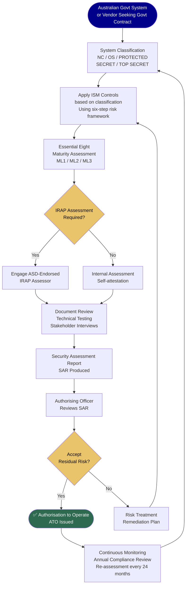

---

### 5.2 ASD Essential Eight

**Issuing Body:** Australian Signals Directorate (ASD)
**Applies To:** All Australian organisations with internet-connected IT networks; mandatory baseline for government
**Legislative Basis:** *SOCI Act 2018* for critical infrastructure; mandatory for Commonwealth via PSPF
**Level:** Federal + widely adopted by state/territory governments

The Essential Eight is a prioritized subset of ISM controls representing the most effective baseline mitigations. It uses a three-level maturity model (ML1/ML2/ML3). Unlike the full ISM, the Essential Eight is often used as a standalone assessment target, particularly by state governments and private sector entities not requiring full IRAP.

**The Eight Strategies:**

1. Application Control
2. Patch Applications
3. Configure Microsoft Office Macro Settings
4. User Application Hardening
5. Restrict Administrative Privileges
6. Patch Operating Systems
7. Multi-Factor Authentication
8. Regular Backups

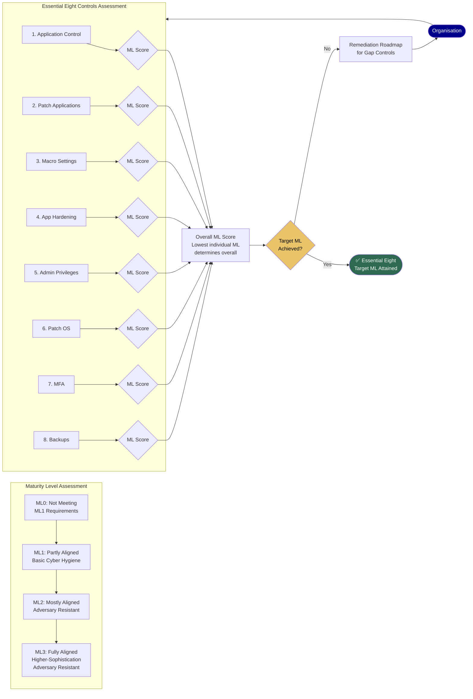

---

### 5.3 APRA CPS 234 — Information Security

**Issuing Body:** Australian Prudential Regulation Authority (APRA)
**Applies To:** All APRA-regulated entities — banks, insurers, superannuation funds, non-operating holding companies
**Legislative Basis:**  *Banking Act 1959* ,  *Insurance Act 1973* , *Superannuation Industry (Supervision) Act 1993*
**Level:** National / Financial Sector

CPS 234 is one of the most prescriptive financial sector IT security standards globally. It requires boards to be accountable for information security, mandates a three-lines-of-defence model, requires annual internal audits of security controls, and mandates notification to APRA of material security incidents within 72 hours. Companion guidance CPG 234 provides implementation detail.

**Key Requirements:**

* Information security capability proportionate to vulnerabilities and threats
* Policy framework maintained and reviewed annually
* Controls testing at least annually or after significant changes
* Third-party (related and unrelated) information security obligations
* Internal audit assessment of control effectiveness

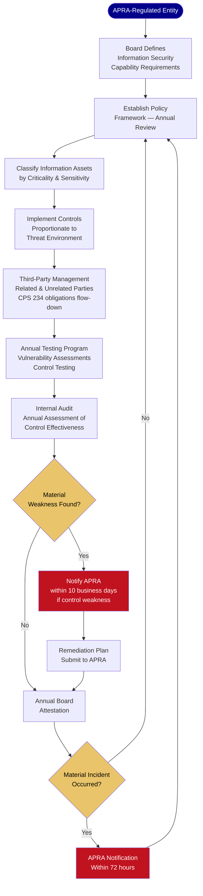

---

## 6. Cross-Sector / International

### 6.1 ISO/IEC 27001:2022 — ISMS

**Issuing Body:** International Organization for Standardization (ISO) / IEC
**Applies To:** Any organisation globally; referenced in legislation across all four regions
**Legislative Standing:** Voluntary standard; referenced as compliance mechanism in NIS2, ENS, BSI Act, OSFI B-13, APRA CPS 234, and many procurement regulations
**Level:** International

ISO 27001 defines requirements for an Information Security Management System (ISMS). Annex A contains 93 controls across 4 themes (Organizational, People, Physical, Technological). Certification is achieved through accredited external audit. ISO 27002 provides implementation guidance. ISO 27005 addresses information security risk management methodology.

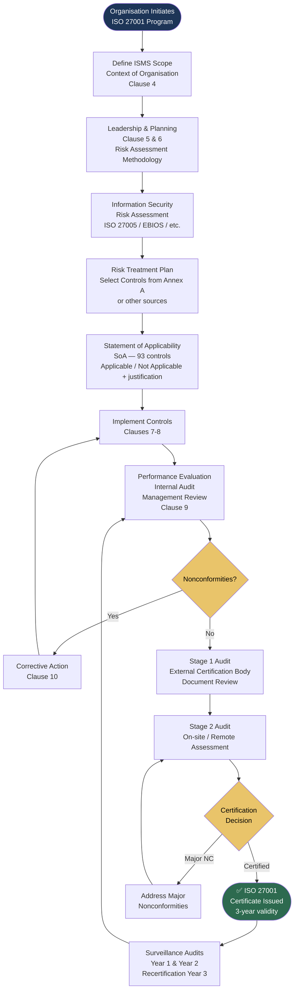

---

### 6.2 SOC 2 Type II

**Issuing Body:** American Institute of CPAs (AICPA)
**Applies To:** Technology and cloud service providers; common requirement in US, Canada, Australia
**Legislative Standing:** Not legally mandated but contractually required by major enterprises and governments; referenced in ITSP.50.105 (CCCS)
**Level:** International / Service Organizations

SOC 2 evaluates service organization controls against five Trust Services Criteria: Security, Availability, Processing Integrity, Confidentiality, and Privacy. Type II covers a period of 6-12 months, making it an evidence of operational effectiveness over time. Commonly required by GC departments, US federal contractors, and APRA-regulated entities assessing their cloud vendors.

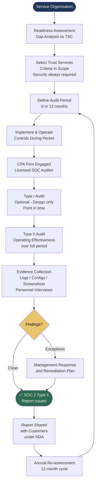

---

### 6.3 PCI DSS 4.0

**Issuing Body:** PCI Security Standards Council (Visa, Mastercard, Amex, Discover, JCB)
**Applies To:** Any organisation storing, processing, or transmitting payment card data globally
**Legislative Standing:** Contractual requirement enforced by card brands; legislated in some US states (Nevada, Minnesota, Washington); referenced in Canadian, Australian, and EU payment regulations
**Level:** Global / Payment Sector

PCI DSS v4.0 (March 2022) defines 12 requirements across 6 control objectives for protecting cardholder data. Organizations validate compliance either via Self-Assessment Questionnaire (SAQ) or Qualified Security Assessor (QSA) audit depending on transaction volume.

```mermaid
flowchart TD
    A([Organisation Handles\nPayment Card Data]) --> B[Define Cardholder\nData Environment CDE\nScope Reduction]
    B --> C[Determine Validation Level\nSAQ or QSA based on\ntransaction volume]
    C --> D{SAQ or\nQSA?}
    D -- SAQ --> E[Self-Assessment\nQuestionnaireCompleted\nby Merchant/Service Provider]
    D -- QSA --> F[Qualified Security\nAssessor Engaged]
    E --> G[12 Requirements\nAssessed]
    F --> G
    G --> H[Report on Compliance\nRoC or SAQ Submitted]
    H --> I{Non-Compliant\nItems?}
    I -- Yes --> J[Compensating Controls\nor Remediation Plan]
    J --> G
    I -- No --> K([✅ PCI DSS\nCompliance Attestation])
    K --> L[Attestation of Compliance\nAoC Filed with Acquirer\nor Card Brand]
    L --> M[Annual Re-validation\nQuarterly Scans by ASV]
    M --> B

    style A fill:#1d3557,color:#fff
    style K fill:#2d6a4f,color:#fff
    style I fill:#e9c46a,color:#000
    style D fill:#e9c46a,color:#000
```

---

## 7. Multi-Framework Data Model

### How to Support Multiple Frameworks in One Tool

The key insight is that all frameworks share the same SA&A lifecycle with three variables:  **control catalogue** ,  **risk classification scheme** , and  **authorization terminology** . Your existing schema only needs extension, not replacement.

```mermaid
erDiagram
    FRAMEWORK {
        int id
        string name
        string short_code
        string country
        string issuing_body
        string legislative_basis
        string government_level
        string sector
        bool active
    }

    RISK_CLASSIFICATION {
        int id
        int framework_id
        string level_name
        int level_order
        string cia_mapping
        string description
    }

    CONTROL_FAMILY {
        int id
        int framework_id
        string family_code
        string family_name
        string description
    }

    CONTROL {
        int id
        int framework_id
        int family_id
        string control_id
        string title
        string description
        string requirement_text
        string guidance
        string tbs_risk_level
    }

    CONTROL_MAPPING {
        int id
        int source_control_id
        int target_control_id
        string mapping_type
        string notes
    }

    ASSESSMENT {
        int id
        int framework_id
        int org_id
        string name
        string status
        string risk_level
        datetime created_at
    }

    ASSESSMENT_CONTROL {
        int id
        int assessment_id
        int control_id
        string status
        string finding
        string evidence_guidance
    }

    FRAMEWORK ||--o{ RISK_CLASSIFICATION : "has levels"
    FRAMEWORK ||--o{ CONTROL_FAMILY : "contains"
    CONTROL_FAMILY ||--o{ CONTROL : "groups"
    CONTROL ||--o{ CONTROL_MAPPING : "maps to"
    FRAMEWORK ||--o{ ASSESSMENT : "used in"
    ASSESSMENT ||--o{ ASSESSMENT_CONTROL : "assesses"
    CONTROL ||--o{ ASSESSMENT_CONTROL : "assessed by"
```

### Framework-to-Framework Control Mapping

Since many frameworks share control concepts (e.g., MFA appears in ITSG-33 IA-2, NIST IA-2, ISO 27001 A.8.5, Essential Eight Control 7, CPS 234, DORA Article 9), the `CONTROL_MAPPING` table allows cross-framework reuse:

```mermaid
flowchart LR
    subgraph Canon["Canonical Control Concepts"]
        CC1[MFA / Identity]
        CC2[Patch Management]
        CC3[Incident Response]
        CC4[Access Control]
        CC5[Audit Logging]
        CC6[Encryption]
        CC7[Risk Assessment]
        CC8[Business Continuity]
    end

    subgraph Frameworks["Framework Control IDs"]
        F1[ITSG-33\nIA-2 / AU-2 / IR-1]
        F2[NIST 800-53\nIA-2 / SI-2 / IR-4]
        F3[ISO 27001\nA.8.5 / A.8.8 / A.5.24]
        F4[Essential Eight\nCtrl 7 / Ctrl 2 / —]
        F5[DORA\nArt.9 / Art.10 / Art.17]
        F6[CPS 234\nPar.15 / Par.21 / Par.29]
    end

    CC1 --- F1 & F2 & F3 & F4 & F5 & F6
    CC2 --- F1 & F2 & F3 & F4
    CC3 --- F1 & F2 & F3 & F5 & F6
```

### Authorization Terminology Mapping

| Your Tool Term                       | ITSG-33            | NIST RMF                 | IRAP/ISM                 | NIS2/DORA              | ISO 27001             | ENS               |
| ------------------------------------ | ------------------ | ------------------------ | ------------------------ | ---------------------- | --------------------- | ----------------- |
| **ATO**                        | ATO Letter         | Authorization to Operate | Authorisation to Operate | —                     | Certificate           | ENS Certificate   |
| **iATO**                       | iATO               | IATT                     | Interim ATO              | —                     | —                    | —                |
| **Authorizing Official**       | AO                 | AO                       | Authorising Officer      | Board / NCA            | Top Management        | Responsible Body  |
| **Security Assessment Report** | SAR                | SAR                      | SAR                      | Audit Report           | Internal Audit Report | Audit Report      |
| **POA&M**                      | POA&M              | POA&M                    | Risk Treatment Plan      | Corrective Action Plan | Corrective Action     | Improvement Plan  |
| **Control Profile**            | Control Profile    | Baseline                 | SCM                      | National Framework     | Annex A / SoA         | ENS Annex II      |
| **Risk Level**                 | Low/Med/High (CIA) | Low/Mod/High (FIPS 199)  | NC/OS/P/S/TS             | Essential/Important    | Accepted/Treated      | Basic/Medium/High |

---

## 8. Framework Comparison Matrix

| Framework                      | Country        | Level    | Sector       | Control Count   | Risk Levels            | ATO Equivalent       | Mandatory            |
| ------------------------------ | -------------- | -------- | ------------ | --------------- | ---------------------- | -------------------- | -------------------- |
| **ITSG-33**              | 🇨🇦 Canada    | Federal  | All Govt     | ~300            | Low/Med/High (CIA)     | ATO Letter           | Yes (GoC)            |
| **CCCS Medium (PBMM)**   | 🇨🇦 Canada    | Federal  | Cloud        | ~200            | PBMM fixed             | ATO Letter           | Yes (GC Cloud)       |
| **OSFI B-13**            | 🇨🇦 Canada    | Federal  | Finance      | Outcomes-based  | —                     | Supervisory Review   | Yes (FRFIs)          |
| **NIST RMF / 800-53**    | 🇺🇸 USA       | Federal  | All          | ~1000+          | Low/Mod/High           | ATO                  | Yes (FISMA)          |
| **FedRAMP**              | 🇺🇸 USA       | Federal  | Cloud        | ~325 Mod        | Low/Mod/High           | P-ATO / ATO          | Yes (Fed Cloud)      |
| **CMMC 2.0**             | 🇺🇸 USA       | Federal  | Defense      | 17–110         | L1/L2/L3               | Certification        | Yes (DoD contracts)  |
| **StateRAMP**            | 🇺🇸 USA       | State    | Cloud        | ~325            | Low/Mod/High           | Provisional Auth.    | Yes (member states)  |
| **NYDFS 500**            | 🇺🇸 USA       | State    | Finance      | ~23 sections    | —                     | Annual Certification | Yes (NY-regulated)   |
| **NIS2**                 | 🇪🇺 EU        | National | 18 sectors   | Outcome-based   | Essential/Important    | NCA Compliance       | Yes (EU)             |
| **DORA**                 | 🇪🇺 EU        | National | Finance      | 5 pillars       | Significant/Other      | ESA Compliance       | Yes (EU Finance)     |
| **BSI IT-Grundschutz**   | 🇩🇪 Germany   | National | All          | 100+ Bausteine  | Normal/High/VH         | Certification        | Yes (govt)           |
| **ANSSI RGS / EBIOS RM** | 🇫🇷 France    | National | Public Admin | 3 levels        | Standard/Enhanced/High | ANSSI Qualification  | Yes (French govt)    |
| **NCSC CAF**             | 🇬🇧 UK        | National | CNI          | 14 outcomes     | IGP scores             | NIS Compliance       | Yes (NIS-regulated)  |
| **ENS (CCN-STIC)**       | 🇪🇸 Spain     | National | Public Admin | ~75 measures    | Basic/Medium/High      | ENS Certificate      | Yes (Spanish govt)   |
| **ASD ISM + IRAP**       | 🇦🇺 Australia | Federal  | All Govt     | ~900+           | NC/OS/P/S/TS           | ATO                  | Yes (Commonwealth)   |
| **ASD Essential Eight**  | 🇦🇺 Australia | Federal+ | All          | 8 strategies    | ML1/ML2/ML3            | ML Attainment        | Yes (PSPF)           |
| **APRA CPS 234**         | 🇦🇺 Australia | National | Finance      | Outcomes-based  | Criticality tiers      | Board Attestation    | Yes (APRA entities)  |
| **ISO/IEC 27001:2022**   | 🌐 Global      | —       | All          | 93 (Annex A)    | Risk-based             | Certificate          | Voluntary/Referenced |
| **SOC 2 Type II**        | 🌐 Global      | —       | Service Orgs | 5 TSC           | —                     | SOC 2 Report         | Contractual          |
| **PCI DSS 4.0**          | 🌐 Global      | —       | Payments     | 12 requirements | —                     | AoC                  | Contractual          |

---

*Document version 1.0 — prepared for SA&A tool multi-framework expansion planning*
*Frameworks included: IT security assessment lifecycles with control catalogues, risk categorization, evidence collection, and authorization/certification outputs only.*
