# Security Assessment & Authorization Tool Guide

Version: 2026-05-07

This guide is for authenticated assessor/admin users and client evidence providers. It walks through the full operating workflow: creating a project, creating or updating the linked intake, uploading documentation, tailoring controls, assigning work, collecting evidence, managing POA&M items, and generating ATO/iATO and project reports.

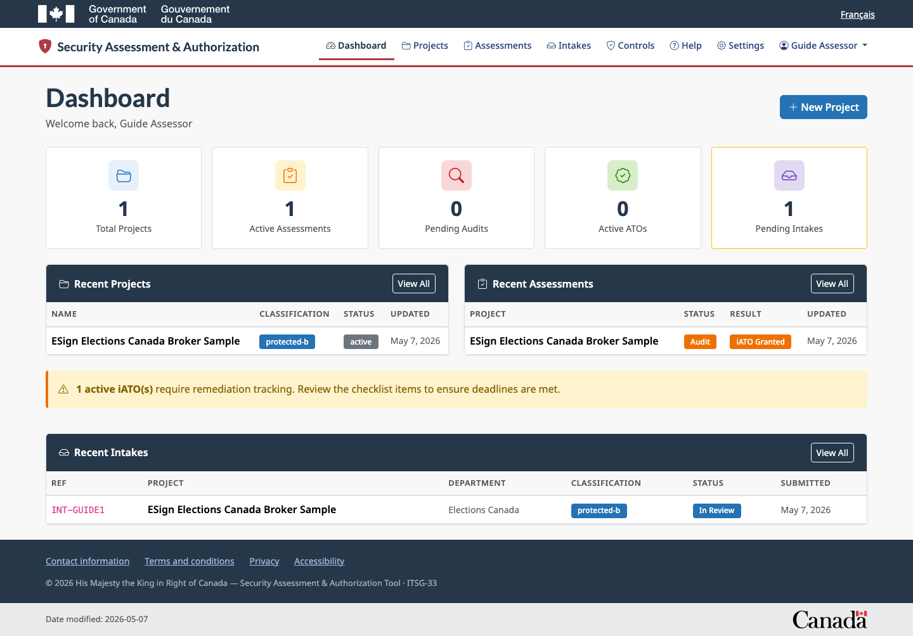

## 1. Roles, Access, And MFA

Assessor/admin users can create projects, create and review intakes, create assessments, tailor controls, assign work, manage evidence guidance, manage POA&M items, create ATO/iATO records, export reports, and browse the security control catalog.

Client users can submit intakes and respond to assigned assessments. Clients can provide evidence, upload supporting files, and submit responses, but they cannot access admin-only project, catalog, or authorization management pages.

Normal assessor and client users should use TOTP MFA. Passkeys may be registered after TOTP setup, but TOTP remains available as a fallback. Break-glass accounts are emergency-only assessor accounts and should not be used for day-to-day testing or assessment work.

## 2. Assessor: Create A Project And Linked Intake

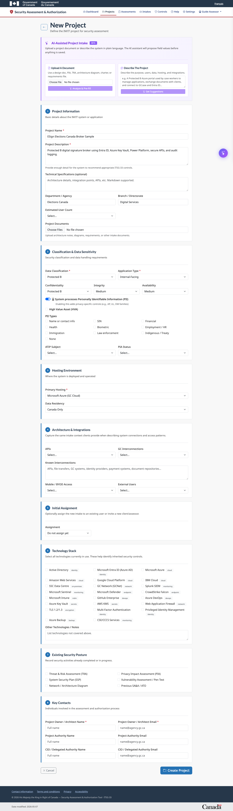

1. Sign in at `/admin/login`.
2. Open **Projects**.
3. Select **New Project**.
4. Use the AI-assisted project intake panel if you have a SADD, architecture document, or plain-language description.
5. Upload the document or paste the project description.
6. Review the proposed field values before using them.
7. Fill in project name, description, department, branch, categorization, hosting model, application type, technology stack, privacy details, contacts, and notes.
8. Optionally assign the new intake to an existing client/assessor or invite a new user.
9. Save the project.

When the project is saved, the application creates the project record and a linked project intake record. If a matching project already exists, the intake updates or links to the existing project rather than creating a duplicate.

## 3. Assessor: Use The Project Dashboard

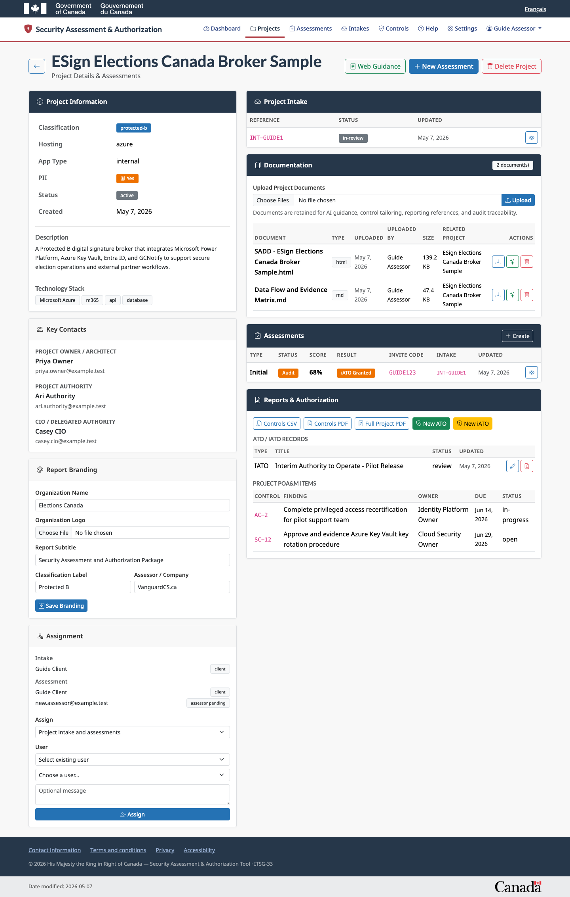

The project dashboard is the main workbench for the assessment package.

Use it to:

1. Confirm project classification, hosting, technology stack, contacts, and project status.
2. Review the linked project intake.
3. Upload and manage project documentation.
4. Create an assessment.
5. Assign the intake or assessment to users.
6. Configure report branding.
7. Export controls CSV, controls PDF, full project PDF, ATO PDFs, or iATO PDFs.
8. Create and edit ATO/iATO records.
9. Review project-level POA&M items.

## 4. Assessor: Upload Documentation

1. Open the project dashboard.
2. Find **Documentation**.
3. Upload SADDs, architecture diagrams, data-flow diagrams, security plans, privacy documents, threat-risk documents, or prior assessment packages.
4. Confirm each document appears in the documentation table.
5. Use the download action to verify the stored file.
6. Use the AI action when the document should support AI-assisted control selection or evidence guidance.
7. Delete only the project document reference when the document should no longer be used for assessment traceability.

Project documents stay associated with the project and can be referenced later by AI utilities, evidence guidance, project reports, and audit review.

## 5. Assessor: Create And Tailor An Assessment

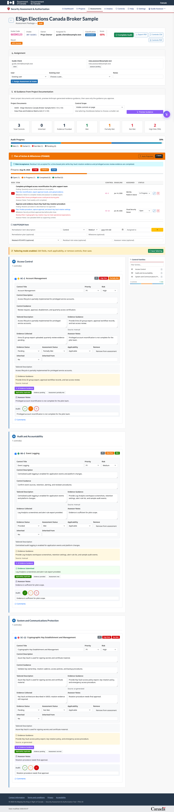

1. Open the project dashboard.
2. Select **New Assessment**.
3. Review the suggested control set.
4. Create the assessment.
5. Open the assessment.
6. Select **Tailor**.
7. For each control, review and edit title, description, control guidance, tailored description, evidence guidance, evidence collected, assessor notes, audit comments, status, applicability, inheritance, priority, and risk.
8. Remove non-applicable controls when needed.
9. Save tailoring changes.
10. Refresh the assessment and confirm the tailored control list and field values persist.

AI can assist with suggested controls and evidence language, but the assessor remains responsible for final control selection and final guidance.

## 6. Assessor: Generate AI Evidence Guidance

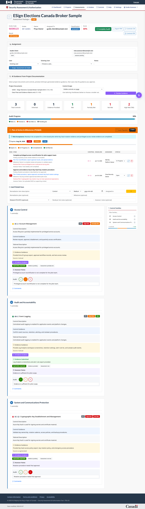

1. Upload project documentation first.
2. Open the assessment.
3. In **AI Guidance From Project Documentation**, select one or more project documents.
4. Choose whether to generate guidance for visible controls or selected controls.
5. Select the controls you want AI to analyze if using the selected-control option.
6. Preview generated guidance.
7. Edit the guidance before saving if needed.
8. Save only the guidance that the assessor approves.

The application should not silently overwrite assessor-entered notes, evidence, or guidance. AI-generated guidance is tracked so users can distinguish generated content from manually entered or edited content.

## 7. Assessor: Assign Existing Users

Use existing-user assignment when the client or assessor already has an active account.

From the project dashboard:

1. Open the project.
2. In **Assignment**, choose the target: all project intake and assessments, one intake, or one assessment.
3. Set **User** to **Select existing user**.
4. Choose the client or assessor from the existing-user list.
5. Add optional assignment notes.
6. Select **Assign**.
7. Confirm the assigned user appears in the intake or assessment assignment list.

From the assessment page:

1. Open the assessment.
2. In **Assignment**, keep **Existing user** selected.
3. Choose the user.
4. Add optional notes.
5. Select **Assign Assessment & Intake**.
6. If the assessment is linked to an intake, the assignment is also copied to the linked intake.

## 8. Assessor: Invite New Users

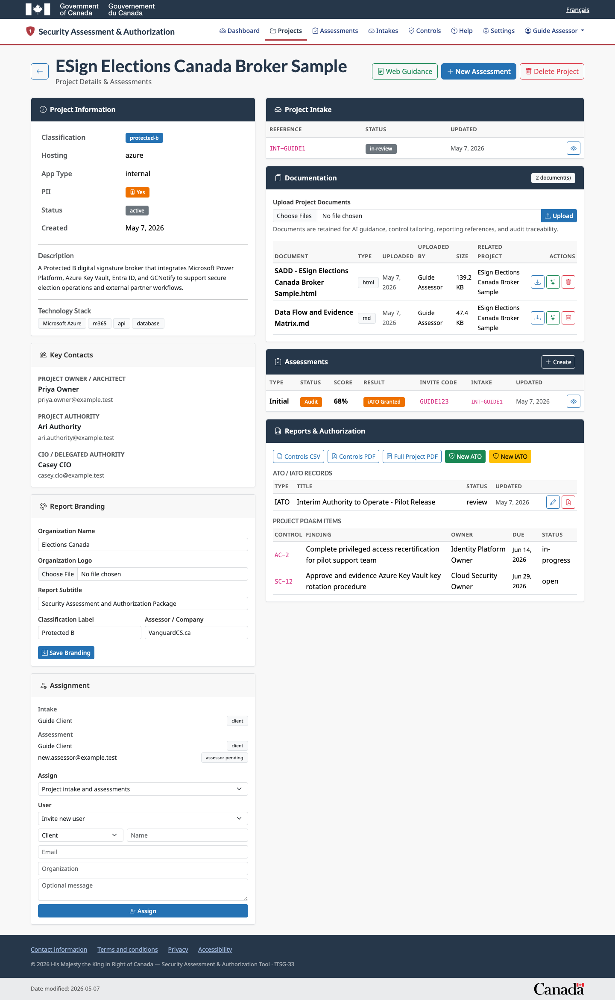

Use invitation assignment when the person does not yet have an account.

From the project dashboard:

1. Open the project.
2. In **Assignment**, choose the target.
3. Set **User** to **Invite new user**.
4. Choose the role: client or assessor.
5. Enter name, email, and organization.
6. Add a short message when helpful.
7. Select **Assign**.
8. If email is configured, the invitation email is sent.
9. If email is not configured, copy the generated invitation code from the success message and share it through an approved channel.

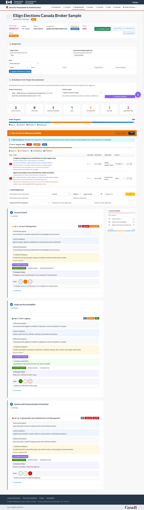

From the assessment page:

1. Open the assessment.
2. In **Assignment**, change **User** to **Invite new user**.
3. Choose whether the invitee is a client or assessor.
4. Enter name, email, organization, and invitation message.
5. Select **Assign Assessment & Intake**.
6. Confirm the pending invite appears in the assignment list.
7. Send or share the assessment invite code when evidence collection is ready.

## 9. Client: Submit Intake Or Provide Updates

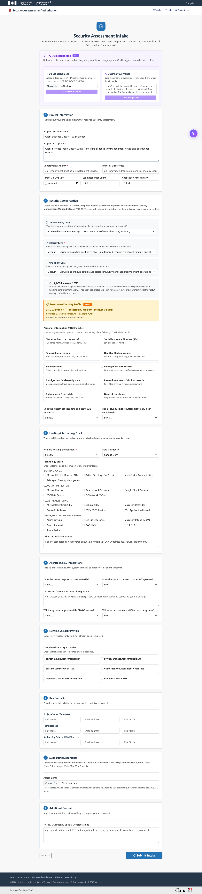

1. Sign in at `/client/login`.
2. Complete TOTP verification when prompted.
3. Open `/intake`.
4. Enter project name and project description.
5. Fill in department, branch, project type, categorization, hosting, technology, privacy, and contact fields.
6. Upload supporting documents when available.
7. Submit the intake.
8. Keep the intake reference code for follow-up with the assessor.

Use clear project descriptions. Mention the system purpose, users, data classification, integrations, hosting environment, planned launch date, and any known security dependencies.

## 10. Client: Respond To An Assigned Assessment

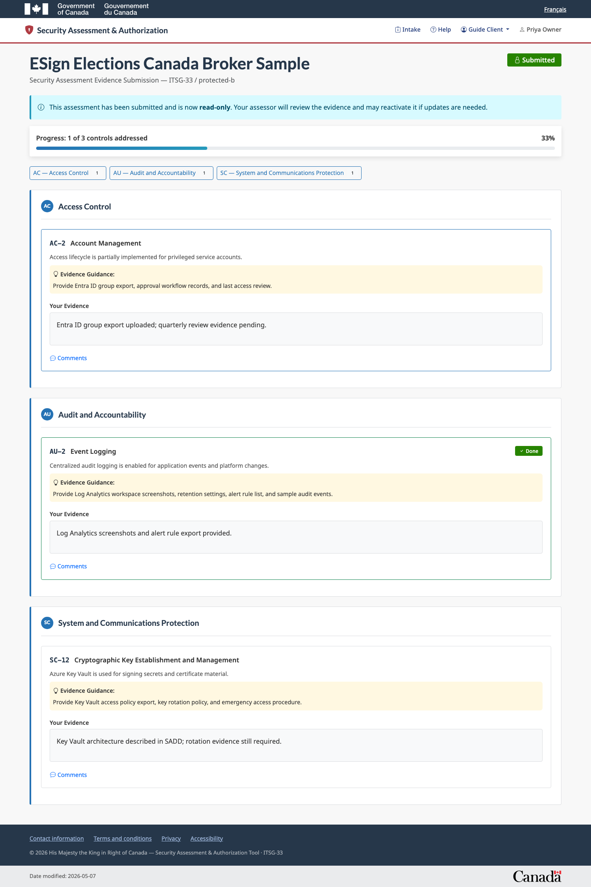

1. Open the assessment link or enter the invite code supplied by the assessor.
2. Sign in with the assigned client account.
3. Review the project name and control list.
4. Read the evidence guidance for each control.
5. Add evidence text, implementation notes, links, screenshots, exports, or document references.
6. Upload evidence files when requested.
7. Save progress as you work.
8. Submit the evidence package when it is ready for assessor review.

Good evidence is current, dated, clearly named, tied to the system under assessment, and specific about which control it supports.

## 11. Assessor: Manage Assessment POA&M Items

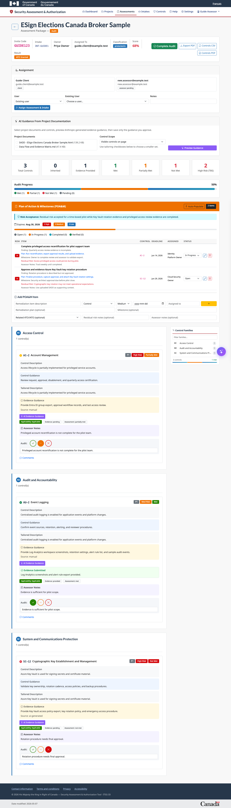

1. Open the assessment.
2. Scroll to **Plan of Action & Milestones (POA&M)**.
3. Use **Auto-Populate** to create remediation items from not-met or partially-met controls, or add a manual item.
4. For each item, set risk, finding description, related control, target date, owner, status, mitigation plan, milestone notes, residual risk, and assessor notes.
5. Link the item to an ATO/iATO record when the remediation belongs in an authorization package.
6. Update status as work moves from open to in progress, completed, and verified.
7. Delete items only when they were created by mistake or no longer belong to the assessment record.

## 12. Assessor: Create ATO/iATO Records

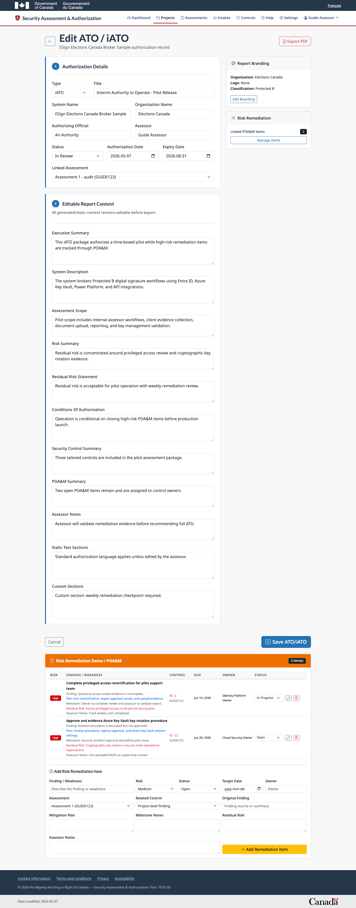

1. Open the project dashboard.
2. In **Reports & Authorization**, select **New ATO** or **New iATO**.
3. Choose the linked assessment when the authorization is based on an assessment package.
4. Edit authorization type, title, system name, organization, authorizing official, assessor, status, authorization date, and expiry date.
5. Edit all report sections before export: executive summary, system description, scope, risk summary, residual risk statement, conditions, security control summary, POA&M summary, assessor notes, static text, and custom sections.
6. Save the ATO/iATO record.

ATO/iATO records are separate records linked to the project. This allows multiple authorization packages over time without overwriting the project or assessment record.

## 13. Assessor: Manage ATO/iATO Remediation Items

1. Open the ATO/iATO record.
2. Scroll to **Risk Remediation Items / POA&M**.
3. Review linked remediation items.
4. Add a new item when the authorization package needs its own risk remediation entry.
5. Choose project-level or assessment-linked remediation.
6. Link a control when the remediation maps to a control finding.
7. Set risk, status, target date, owner, original finding, mitigation plan, milestones, residual risk, and assessor notes.
8. Use the edit action to update any field.
9. Use the status drop-down for quick status updates.
10. Delete items that should be removed from the authorization package.

Items managed here appear in ATO/iATO PDF reports and can also appear in full project reports.

## 14. Assessor: Export Reports

From the project dashboard or assessment page, export:

1. **Controls CSV** for Excel-compatible control review.
2. **Controls PDF** for formatted control assessment output.
3. **Full Project PDF** for project overview, documents list, assessment summary, controls, evidence summaries, POA&M, and authorization summary.
4. **Assessment PDF** for a security assessment report.
5. **ATO/iATO PDF** for the authorization package, conditions, risk statements, POA&M, and signature section.

Project reports list uploaded documents for traceability but do not embed the uploaded attachments.

## 15. Assessor: Use The Security Control Catalog

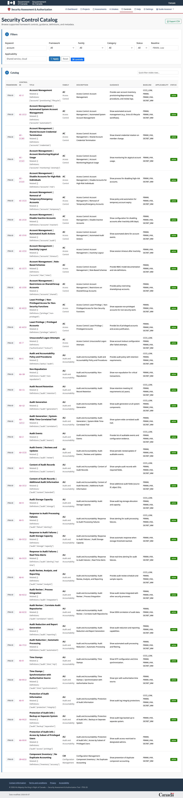

1. Open `/admin/security-controls`.
2. Search by keyword, control ID, title, description, guidance, or definitions.
3. Filter by framework, family, baseline, category, applicability, or status.
4. Sort and review the control metadata.
5. Export the filtered catalog to CSV when you need an offline or Excel-compatible view.

## 16. Help Menu And Troubleshooting

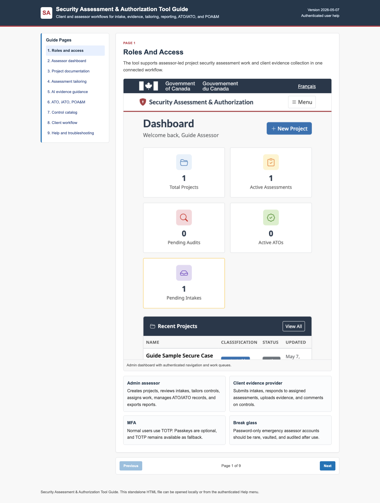

Authenticated assessors and clients can open **Help** from the application header. The standalone HTML guide is available at `docs/client-assessor-guide.html`.

Common issues:

1. **Invitation code fails:** Check for spaces, expiry, and whether the user is registering with the invited email address.
2. **Assigned work is missing:** Sign out and sign in with the exact assigned account.
3. **TOTP fails:** Check device time and use the newest code.
4. **Upload fails:** Confirm file type and file size.
5. **AI guidance unavailable:** Confirm the Anthropic API key is configured.
6. **PDF export fails:** Confirm the project has the required assessment, controls, branding, or ATO/iATO record.
7. **POA&M item missing from an ATO/iATO:** Confirm the item is linked to the correct ATO/iATO record.
