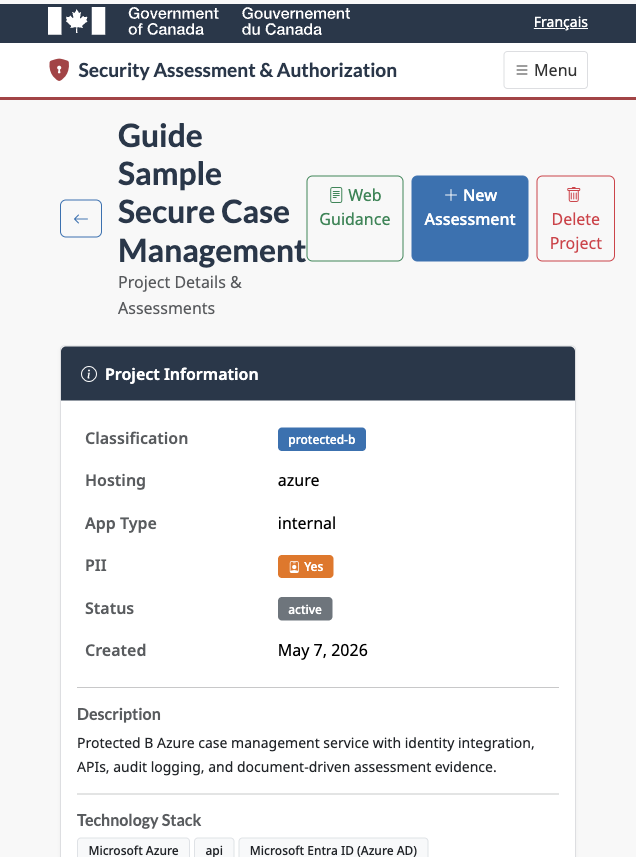
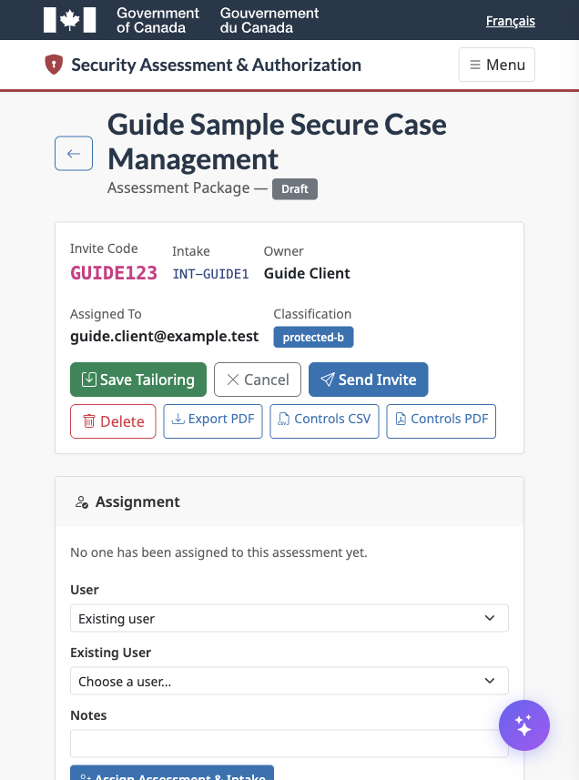
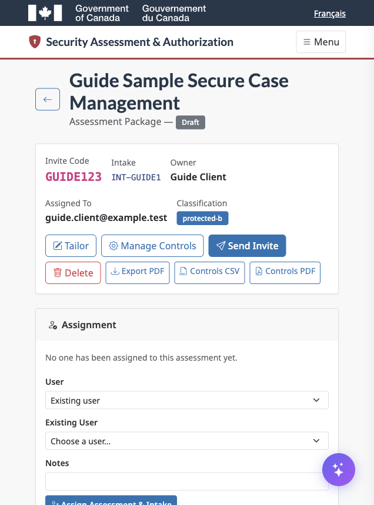
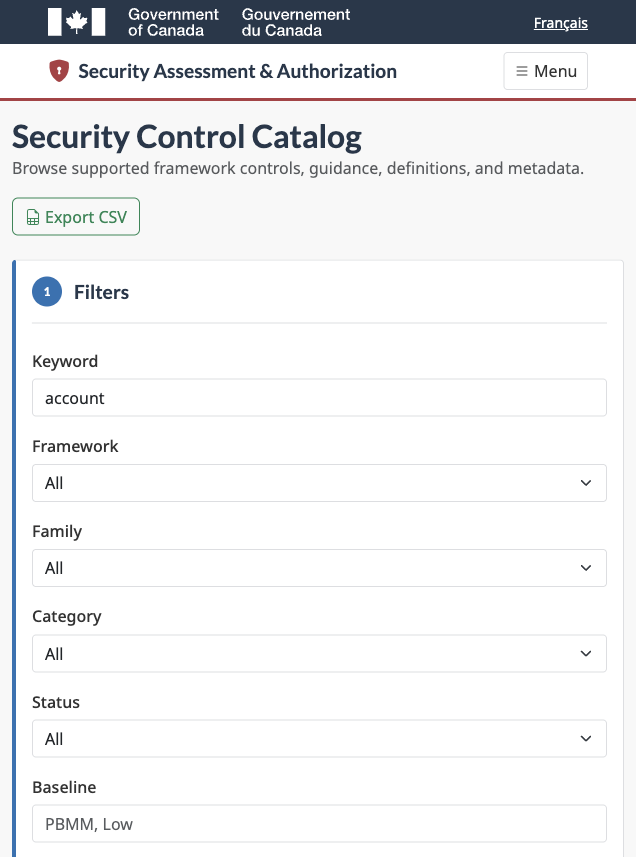
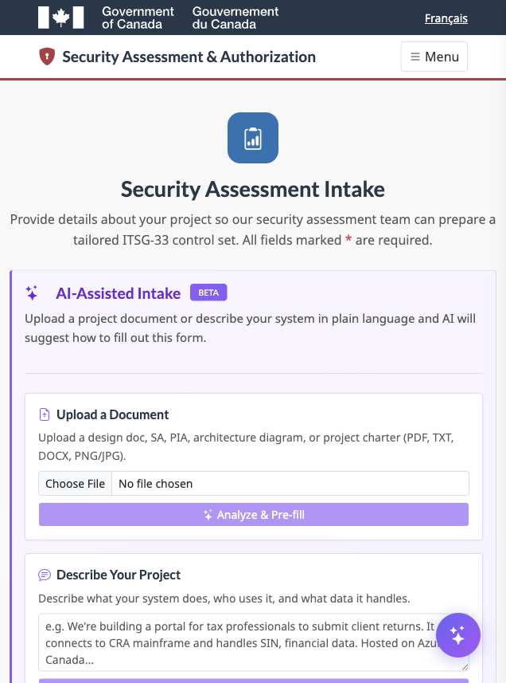
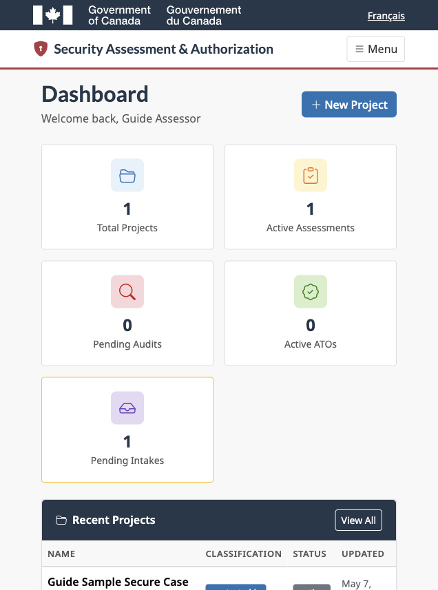

# Security Assessment & Authorization Tool Guide

Version: 2026-05-07

This guide is for authenticated assessors, administrators, and client evidence providers using the Security Assessment & Authorization Tool.

## Page 1: Roles And Access

Admin assessors can create projects, review intakes, tailor controls, generate evidence guidance, manage POA&M items, create ATO/iATO records, export reports, and browse the security control catalog.

Client evidence providers can submit intakes, respond to assigned assessments, upload evidence, and comment on control requests. Clients do not have access to the admin dashboard.

All normal users should use TOTP MFA. Passkeys are optional after TOTP is configured, and TOTP remains available as a fallback. Break-glass accounts are emergency assessor accounts only.

## Page 2: Assessor Dashboard

Use the admin dashboard to move from intake to project to assessment:

1. Open Projects.
2. Create or open a project.
3. Upload supporting project documentation.
4. Create an assessment from the project.
5. Tailor the selected controls.
6. Assign the intake or assessment to an existing user or invite a new user.
7. Manage reports, ATO/iATO records, and POA&M items from the project dashboard.

## Page 3: Project Documentation

Project documents are stored with the project for later review, AI analysis, control tailoring, report references, and audit traceability.

Recommended document types include:

- Solution Architecture Design Documents.
- Security plans.
- Architecture diagrams.
- Data-flow diagrams.
- Privacy or threat-risk documents.
- Previous assessment packages.

Uploaded documents can be downloaded, deleted as a project reference, or used for AI-assisted control selection and evidence guidance.

## Page 4: Assessment Tailoring

Assessors remain in control of tailoring decisions.

Use Tailor on the assessment page to edit:

- Applicability.
- Control title and description.
- Control guidance.
- Tailored description.
- Evidence guidance.
- Evidence collected.
- Assessor notes.
- Assessment status.
- Evidence status.
- Inheritance.
- Priority and risk level.

Save tailoring changes before refreshing or leaving the page.

## Page 5: AI Evidence Guidance

Use AI guidance only as assessor-reviewed draft content:

1. Upload project documentation.
2. Open an assessment.
3. Select one or more project documents.
4. Select the target controls.
5. Generate guidance.
6. Review and edit the preview.
7. Save only approved guidance.

The application tracks AI-generated guidance and marks guidance edited after generation. Existing assessor-entered content is not silently overwritten.

## Page 6: ATO, iATO, And POA&M

Create ATO or iATO records from the project dashboard. All authorization sections are editable before export, including executive summary, system description, scope, risk statements, authorization conditions, POA&M summary, assessor notes, static text, and custom sections.

POA&M items can be added from the assessment page and linked to controls and ATO/iATO records. Track the finding, risk rating, owner, target date, status, mitigation plan, milestones, residual risk, and assessor notes.

## Page 7: Security Control Catalog

Admin assessors can open `/admin/security-controls` to search and filter all supported security controls. Filters include framework, family, category, baseline, applicability, status, and keyword. The catalog can be exported to CSV for Excel-compatible review.

## Page 8: Client Evidence Workflow

Clients can:

1. Sign in with TOTP.
2. Submit a new intake.
3. Open assigned assessment links.
4. Review assessor evidence guidance.
5. Provide evidence text and supporting attachments.
6. Save progress and submit when the package is ready.

Good evidence is current, clearly named, dated, tied to the system under assessment, and specific about which control it supports.

## Page 9: Help Menu

Authenticated assessors and clients can open Help from the application header. The HTML guide is also available as a standalone file at `docs/client-assessor-guide.html`.

## Troubleshooting

If a page does not show expected work, confirm you are signed in with the assigned account.

If TOTP fails, check device time and use the newest code.

If uploads fail, check the file size limit and file type.

If AI guidance is unavailable, confirm the Anthropic API key is configured.

If an export fails, confirm the project has the required assessment or authorization records and try again.
